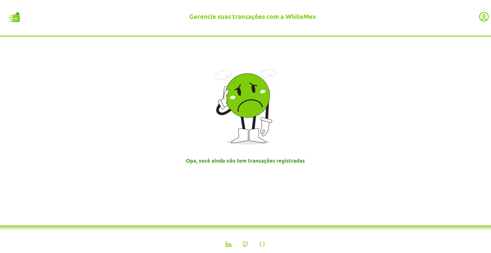

# whitemex-danilo-test

This is a test for fullstack developer at WhiteMex Company made in a week.

This is a fullstack application built with the fammous MERN STACK. It' is a simulation for an credit card transactions webapp, with full authentication, user creation, transaction creation, transaction listing, loading skeletons, api documentation with swagger and so on...

## Front-end

The front-end of this application is developed using:

- Typescript: a superset of that gives JavaScript language superpowers. 
- Vite: a fast build tool for modern web development.
- React: a popular JavaScript library for building user interfaces (SPA approach).
- Formik: a library for building forms with React.
- Yup: a schema validation library.
- Tailwind CSS: a utility-first CSS framework.
- React Query: a library for fetching and managing async data in React applications.
- Shadcn-ui : a new ui component library

## Back-end

The back-end of this application is developed using:

- Typescript: a superset of that gives JavaScript language superpowers. 
- Node.js: a JavaScript runtime for server-side development.
- Express: a fast and minimalist web application framework for Node.js.
- MongoBD: a NoSql lightweight database.
- Swagger: to api docs.

## Getting Started

> :warning: **WARNING **: This monorepo requires Docker and Docker Compose  installed before proceeding.

To get started with this project, follow the steps below:

1. Clone the repository.

```bash
git clone https://github.com/Danilo-Guedes/whitemex-danilo-test.git
```

2. cd into the project folder.

```bash
cd whitemex-danilo-test
```

3. run the docker compose to initiate the application.

```bash
docker-compose up --build
```

4. Open the browser at http://localhost:5173/ (default port for vite apps) and use the application.

## What I would do if I had more time ?

1. Adopt a DDD or Clean Architecture approach to prepare the code for a healthier and growth.
2. As you create the domain entities, make better use of OOP and making sure the core functionalities are not coupled with third party libraries, making sure the code is easier to maintain and easier to test.
3. Write tests for the application.
4. Create a class to standardize backend errors.
5. Add better loading states (skeletons and spinners) and of course add small animation to make the UI and UX even more friendly.

## Screenshots





## License

This project is licensed under the [MIT License](LICENSE).
